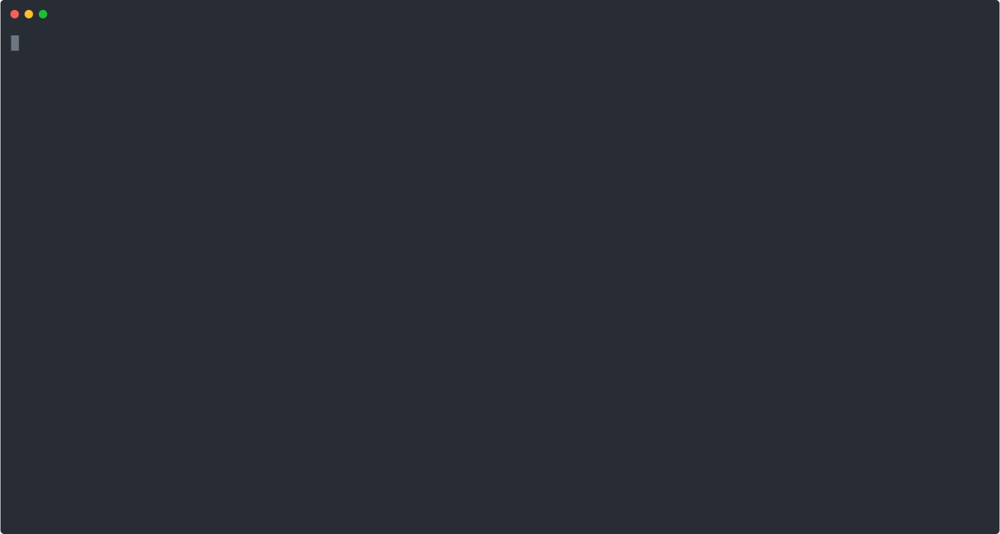

<div align="center">
  <h1><a href="https://github.com/hytromo/mimosa">
      <br />
      mimosa
    </a></h1>

  <a href="https://github.com/hytromo/mimosa/releases"></a>
  <a href="https://github.com/hytromo/mimosa/blob/main/LICENSE"></a>
  <a href="https://github.com/hytromo/mimosa/actions/workflows/main.yml"></a>
  <a href="https://app.codecov.io/gh/hytromo/mimosa/"></a>
  <a href="https://github.com/hytromo/mimosa/stargazers"></a>
  <p><em>Zero-config Docker image promotion</em></p>

</div>

> [!WARNING]
> While `mimosa` has an extensive testing suite, it hasn't yet been heavily tested in production. If you find a bug, please [open an issue](https://github.com/hytromo/mimosa/issues/new). Caution is advised for production usage.

# What does it do

* **No more wasteful docker builds** - you don't have to wait for CI to finish just because of a tiny change in the README - the README doesn't even end up inside the docker image!
* **Image promotion - for free** - you've tested your changes in a branch, so why should you wait for `main`/`master` to rebuild, and also risk producing a different image? Use Mimosa and skip straight to deployment.

# How does it do it

Just prepend your docker build commands like this: `mimosa remember -- docker buildx build ...` and Mimosa makes sure you don't run the same build twice. If you've run the same build before, it reaches out to your container registry and retags the previously built image instead.

<p align="center">
  
</p>


* It calculates a unique hash based on your docker command, build context, and your `Dockerfile`/`.dockerignore` files.  
* It saves the hash-tag map to the cache.  
* If it calculates the same hash in the future, it simply retags the already built image instead of rebuilding.  
* All without downloading or reuploading the image - that's what makes it fast.  
* If it hasn't seen the hash before, it builds the image as normal - no tricks. The hash is then saved to the cache for future use.
* Falls back to normal command execution in case of any errors.

# Key Features

- **Seamless docker Integration:**  
  Mimosa wraps standard `docker buildx build/bake` commands. You use it by passing the same arguments you would to Docker.

- **Automatic Context and Dockerfile Detection:**  
  Mimosa automatically detects the build context, Dockerfile, bakefile and `.dockerignore` (including custom-named dockerignore files). It accounts for exactly what's needed to ensure that your build gets a unique cache key. It ignores all files specified in your `.dockerignore`, so a well-maintained `.dockerignore` makes all the difference.

- **Seamless Integration with GitHub Actions:**  
  `mimosa` works with `actions/cache` as well as its own `hytromo/mimosa/gh/cache-action` action, which offers repository-scoped caching [instead of branch-scoped](https://docs.github.com/en/actions/reference/dependency-caching-reference#restrictions-for-accessing-a-cache) - which means that all your branches can have unrestricted access to the same cache at the same time.

# Installation

## Inside GitHub Actions

Just replace your `docker/build-push-action` with `hytromo/mimosa/gh/build-push-action` in your GitHub Actions workflow and give read and write access to the `MIMOSA_CACHE` variable.

```yaml
  - uses: hytromo/mimosa/gh/build-push-action@v6-build-push
    with:
      platforms: linux/amd64,linux/arm64
      push: "true"
      tags: my-org/my-image:${{ github.sha }}
      mimosa-cache-github-token: ${{ secrets.WRITE_VARIABLES_GH_PAT }}
    env:
      MIMOSA_CACHE: ${{ vars.MIMOSA_CACHE }}
```

See the [GitHub Action docs](./docs/gh-actions/README.md) for details on how to use `mimosa` in your GitHub Actions.

## On your system

Pre-built binaries are available on the [Releases page](https://github.com/hytromo/mimosa/releases). Download the appropriate binary for your platform and add it to your `PATH`.

# CLI usage

## Remember

```sh
# do a typical docker buildx build/bake
mimosa remember -- docker buildx build --build-arg MYARG=MYVALUE --platform linux/amd64,linux/arm64 --push -t hytromo/mimosa-example:v1 .

# Now change something that should not influence the build result:
mimosa remember -- docker buildx build --build-arg MYARG=MYVALUE --platform linux/amd64,linux/arm64 --push -t hytromo/mimosa-example:v2 .

# ... mimosa understands that nothing important has changed, so it just makes v2 point to v1 - they are the same image - no build happens!

# Docker Bake support - cache multiple targets and tags
mimosa remember -- docker buildx bake -f docker-bake.hcl

# dry run - do not build, retag or write to cache, just show what would happen
mimosa remember --dry-run -- docker buildx build --build-arg MYARG=MYVALUE --platform linux/amd64,linux/arm64 --push -t hytromo/mimosa-example:v2 .
```

* The `remember` subcommand tells Mimosa to retag the image, if the same build has been run before, otherwise to run and cache the build.
* The rest of the command is exactly what you'd pass to `docker buildx build/bake`.

## Cache

### Cache Management

```sh
mimosa cache --show # Show where the cache is being saved

# forget cache associated with a specific build - this influences the local cache only, it doesn't touch the remote registry
mimosa forget -- docker buildx build --build-arg MYARG=MYVALUE --platform linux/amd64,linux/arm64 --push -t hytromo/mimosa-example:v1 .

mimosa forget --older-than 6M # Forget entries older than 6 months
mimosa forget --older-than 24h # Forget entries older than 24 hours

mimosa forget --older-than 1y --yes # No user prompt
mimosa forget --everything # Delete all entries
```

## Shell completion

Enable completion for all the popular shells, by following the information under the `completion` command:

```bash
mimosa completion --help
mimosa completion zsh --help
mimosa completion <your-shell> --help
``` 

## Advanced usage

### Log level

You can use the `LOG_LEVEL` env variable to control the log level, use `LOG_LEVEL=debug` for debug logging. Alternatively you can pass the `--debug` flag on every command.

# FAQ

## What about multi-platform builds?

Mimosa supports multi-platform builds. It looks into the existing docker image's index manifests and makes the new tag point to the same ones - no matter how many or which they are.

## What about custom build contexts?

Mimosa analyzes the docker command and understands what your build context is, whether it's `.` or something else.

## How does it work for multiple targets in a bakefile?

If you are using `docker buildx bake`, a single cache is created for the whole build - in this cache the generated tag(s) are saved for each target separately.

This means practically that if a single target changes, the whole build is invalidated and all the targets need to be rebuilt. This is a design decision, because `mimosa` is not a build tool - it doesn't decide how to build the targets - so building some of the targets itself while retagging others is out of the scope of this application. To make things more complex, [targets can depend on each other](https://docs.docker.com/build/bake/contexts/#using-a-target-as-a-build-context) - so it is the safe choice to invalidate the whole build.

## What about custom Dockerfile locations?

If you specify `-f` / `--file`, it will use that file instead of the default `Dockerfile`.

## What about custom `.dockerignore` files?

`<Dockerfile name>.dockerignore` takes precedence over `.dockerignore` ([docs](https://docs.docker.com/build/concepts/context/#dockerignore-files)) - Mimosa knows these rules.

## Can I use normal docker build commands?

Mimosa is not tested with `docker build` commands and it is recommended to use `docker buildx build`/`docker buildx bake` commands with the `--push` flag.

## Yet another way for my build to fail?

Mimosa takes all the possible precautions to just run the provided command if it fails to calculate the hash, or has any other kind of issue.
In fact, it is so permissive that it can run any command - freely:
```bash
# it will detect that this is not a docker command, and it will just run it, even respecting its exit code
mimosa remember -- echo I am run via mimosa
```

Mimosa will also always respect the exit code of the docker command and will exit with the same code, so you can rest assured that any custom scripts or behaviors will continue working as expected.

## What's up with the name?

*Mimosa pudica* is a plant that closes its leaves on touch to protect itself.

If the plant is repeatedly exposed to a non-harmful stimulus, such as a gentle touch or a repeated drop that doesn't cause actual damage, it will eventually stop responding. This phenomenon is called habituation, which is considered the simplest form of learning. The plant "learns" that the repeated disturbance is not a threat and thus doesn't need to expend energy on closing its leaves.

# Contributing

Read [CONTRIBUTING.md](./CONTRIBUTING.md)
